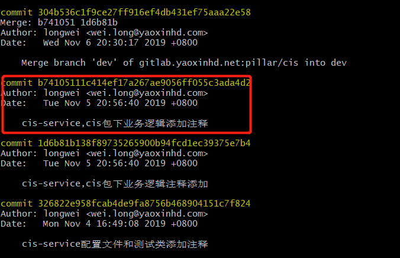
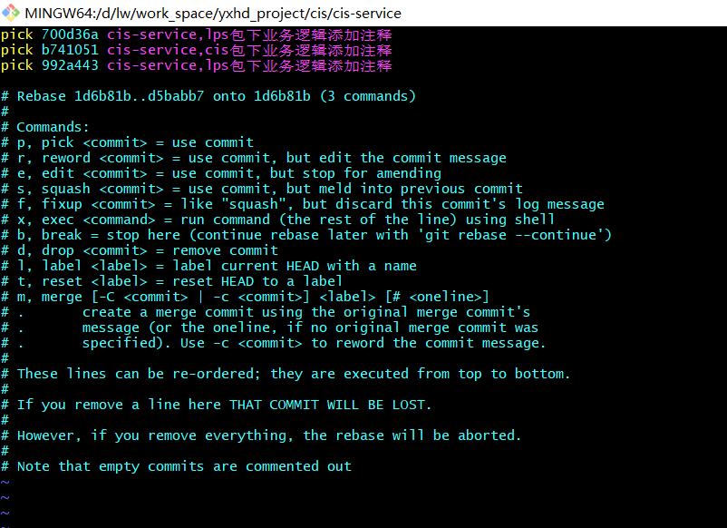
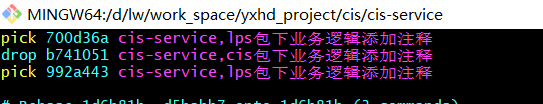
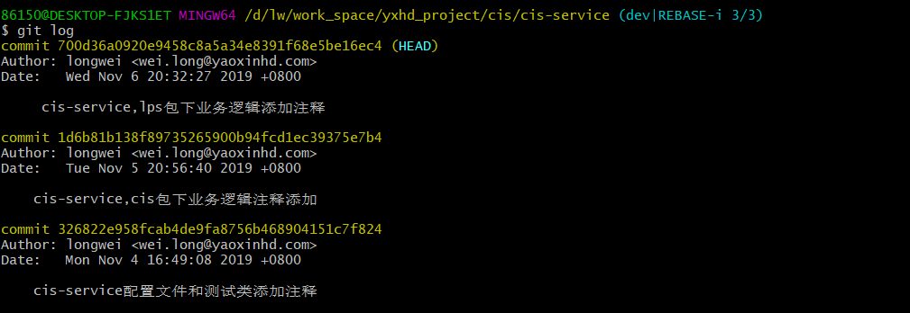

## git删除指定commit

1.  使用git log 命令，查看已提交的记录。例如红色圈出的commit是本次要删除的commit。

 

2.  先找到此次提交之前的一次提交的commit 1d6b81b138f89735265900b94fcd1ec39375e7b4

3.  执行git rebase -i 1d6b81b138f89735265900b94fcd1ec39375e7b4，弹出如下页面（不包含当前commit）：

 

按字母I键进入编辑模式，将需要删除的commit的pick改为drop，然后按esc退出编辑，：wq保存

 

4.  再次执行git log命令，查看已提交记录，之前红色圈出的commit记录已被删除。

