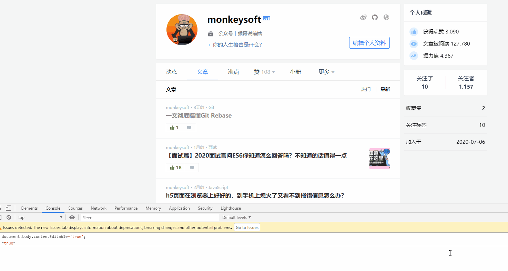

### 浏览器秒变编辑器

这个还是在浏览器地址栏上面做文章，将以下代码复制粘贴到浏览器地址栏，运行后浏览器就变成了一个原始简单的编辑器，和window自带的notepad差不多，长见识了吧，话不多说，我们来试试。

``` JavaScript
data: text / html, < html contenteditable >
```


> 归根结底多亏了HTML5中新加的contenteditable属性，当元素指定了该属性后，元素的内容成为可编辑状态。

同理，在控制台执行以下代码，同样可以将整个页面变得可以编辑。

> document.body.contentEditable='true'; 



### 实时编写样式的输入框

<br>

同理，也是利用了HTML5中的contenteditable属性，巧妙的在body增加一个可编辑的style标签。

<br>

``` html
<body>
  <style style="display:block; position: fixed;" contentEditable>
    body {
      background: red;
    }
  </style>
</body>
```


<br>

### 利用a标签解析url

<br>

很多时候我们有从一个URL中提取域名，查询关键字，变量参数值等的需要, 然而处理 url 字符串是比较麻烦的，可以使用 a 标签自动解析 url。

<br>

主要方法就是在JS中创建一个a标签，然后将需要处理的URL赋值给我们新创建的a标签的href属性，然后就可以得到我们想要的东西了。

<br>

``` javascript
var a = document.createElement('a');
a.href = 'https://juejin.cn/user/2796746682939054/posts';
console.log(a.host);
```

<br>


<br>

利用这一方法，稍微进行封装一下，就可以得到一个非常实用的工具函数了，下面提供一个网上常见的封装示例。

``` javascript
function urlParse(url, key) {
  var a = document.createElement('a')
  a.href = url
  var result = {
    href: url,
    protocol: a.protocol.replace(':', ''),
    port: a.port,
    query: a.search,
    params: (function() {
      var ret = {},
        centArr,
        seg = a.search.replace(/^\?/, '').replace(/^\?/, '').split('&')
      for (i = 0, len = seg.length; i < len; i++) {
        if (!seg[i]) {
          continue
        }
        centArr = seg[i].split('=')
        ret[centArr[0]] = centArr[1]
      }
      return ret
    }()),
    hash: a.hash,
    file: (a.pathname.match(/\/([^\/?#]+)$/i) || [, ''])[1],
    path: a.pathname.replace(/^([^\/])/, '/$1'),
    relative: (a.href.match(/tps?:\/\/[^\/]+(.+)/) || [, ''])[1],
    segments: a.pathname.replace(/^\//, '').split('/')
  }
  a = null
  return key ? result[key] : result
}
```

<br>

> H5 有新的 API URL 也可以快速的处理一个链接

<br>

``` JavaScript
var url = new URL('https://www.baidu.com/')
url.hash
  ...
```
