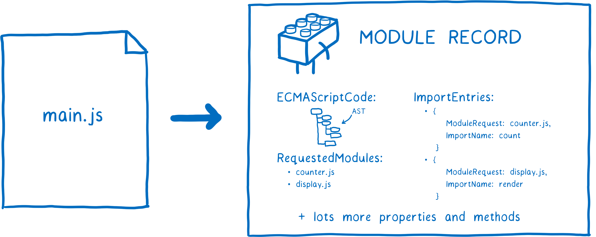

### 模块化解决了什么问题

我们仔细想一下，Javascript编程其实很多时候就是管理变量以及变量赋值这件事，比如把一个value赋值给一个变量，给一个变量加上一个value，或者把两个变量相加的结果赋值给另外一个变量，怎样去管理这些变量对日后如何维护这些代码就显得至关重要。

在开发中如果我们一次仅需要考虑几个变量，那么工作就会变得很简单。幸运的是，JavsScript有个作用域链来帮助我们解决变量过多的问题，因为作用域链的存在，在一个函数的内部无法访问另外一个函数内部的变量，这样就使得我们在编程的时候只需要关注自己函数内部的那几个变量就可以了，不需要过分去担心其他函数的影响，头发也可以少掉几根。

但是，很多时候我们不得不跟其他函数共享状态，这时候我们会将这些变量存储在全局（window/global）上，项目小的时候当然问题不大，但是当项目一大，变量一多，通过script引入代码的加载顺序等等问题就开始让后期维护变得很蛋疼，因此人们开始思考如何在没有模块的语言上去实现模块这一件事情。。。

### 原始时期

#### 直接定义依赖

``` js
function a() {}

function b() {}
```

在原始时期，“模块化”也就是直接定义函数，共享变量，这种做法最明显的缺点就是**污染**了全局变量，变量的重名会导致后面覆盖前面，并且各个模块成员之间看不出有什么直接的关系。

#### 闭包模块化

``` js
var modules = (fuction(my, $) {
    function privateMethod() {
        // ...
    }

    my.moduleProperty = 1;
    my.moduleMethod = function() {
        //$()....
        //privateMethod()...
        // ...
    };

    return my;
}(widnow.modules || {}, jQuery))
```

通过立即执行函数（IIFE），外部函数无法调用到里面的**privateMethod**，解决了全局变量污染的问题。同时这种模式还可以将一个模块拆分，在闭包内可以调用或继承其他子模块、添加新的方法，新的变量，返回新的模块。但是同时缺点也很明显：

*   为了在模块内部调用其他全局变量，必须**显示注入全局变量**，比如上面注入了jQuery
*   跨文件使用模块时，需要将模块挂载到全局变量上（window）上
*   没有解决如何管理这些模块的问题，各个模块之间的依赖关系需要通过script的引入顺序来保证

### CommonJS

#### 概述

从1999年开始，js模块化的探索都是基于语言层面上的优化，真正的改变要从2009年CommonJS的引入开始，Node采用CommonJS模块规范，每个文件就是一个模块，有自己的作用域，在一个文件里面定义的变量、函数、类都是私有了。

``` js
// package/lib is a dependency we require
const lib = require('package/lib');

// some behaviour for our module
function foo() {
    lib.log('hello world!');
}

// export (expose) foo to other modules
exports.foo = foo;
```

#### 规范

*   module模块本身，是Module的一个实例
*   exports指向module.exports，可以通过exports向module.exports对象中添加变量
*   require用于加载模块（核心）

#### 特点

*   所有模块都运行在模块作用域，不会污染全局作用域
*   模块加载的顺序，按照代码中出现的顺序执行（也就是同步）
*   模块输入的值是复制（基础类型为复制，引用类型为值引用），第一次加载结果就被缓存了，之后再加载就直接读取缓存中的结果，如果要让模块再次运行，需要清除缓存。或者直接导出函数，每次调用函数重新计算。

#### 实现

由于篇幅有限，这里不讨论require的加载选择路径优先级的判断，也不讨论模块缓存的过程，并假定加载的文件都是js文件，主要实现代码如下[源代码](https://github.com/joyent/node/blob/master/lib/module.js)

``` js
function Module(id, parent) {
    this.id = id;
    this.expotrs = {};
    this.parent = parent;
    if (parent && parent.children) {
        parent.children.push(this);
    }
    this.fileanme = null;
    this.loaded = false;
    this.children = [];
}
// 这里的module是全局变量
module.exports = Module;

// 通过一个path加载模块，并返回exports属性
Module.prototype.require = function(path) {
    return Module._load(path, this);
}

Module._load = function(path, parent) {
    const filename = path;
    var module = new Module(filename, parent);
    // 加载模块
    module.load(filename);

    // 输出模块的exports属性
    return module.exports;
}

Module.prototype.load = function(filename) {
    // 通过磁盘中读取文件
    var content = fs.readFileSync(filename, 'utf8');
    module._compile(content, filename);
    this.loaded = true;
}

// 模块编译
Module.prototype._compile = function(content, filename) {
    const self = this;
    const args = [self.exports, require, self, filename, dirname];
    // 在沙箱中执行代码
    return compiledWrapper.apply(self.exports, args);
}
```

从代码中可以看出，模块加载实质上就是注入了exports，require，module三个全局变量，然后执行模块的源码，最后将模块的exports的变量输入

``` js
(function(exports, require, module, __filename, __dirname) {
    // 模块源码
});
```

#### 不足

*   缺少模块封装的能力，CommonJS规范中每个模块都是一个文件，这意味着每个文件只有一个模块。这在服务器上是可行的，但是在浏览器中就不是很友好，浏览器中需要做到尽可能少的发起请求。
*   使用同步的方式加载依赖，在浏览器中由于JS的加载会阻塞渲染，同步加载会导致长时间的白屏，对于用户体验是致命的。
*   CommonJS规范中使用了**export**的对象来暴露模块，可以讲需要导出的变量附加到**export**上，但是要导出一个函数确是能使用**module.export**，这种语法容易让人感到困惑。

### AMD

#### 概述

AMD，全称是Asynchronous Module Definition，即异步模块加载机制，它采用异步方式加载模块，模块的加载不影响后面语句的运行，AMD规范定义了一个**define**全局方法用来定义和加载模块

``` js
define(id ? , dependencies ? , factory);
```

*   id: 模块标识，可以省略
*   dependences：所依赖的模块数组，可以省略
*   factory：模块的实现，或者一个对象

AMD也使用了使用**require**全局方法来加载模块，但不同于CommonJS，它要求两个参数，dependences是需要前置的依赖，只有所有前置依赖都加载完了才会触发回调函数，dependences的加载是**通过动态创建sciprt和事件监听的方式来异步加载模块**，解决了CommonJS同步加载的问题。

``` js
require([dependence], callback);
```

#### RequireJS使用

RequireJS 是 AMD 规范的代表之作，基本使用方式如下

``` js
define(['./a', './b'], function(moduleA, moduleB) {
    // 依赖前置
    moduleA.mehodA();
    console.log(moduleB.dataB);
    // 导出数据
    return {};
});
```

#### RequireJS的实现

这里同样不讨论RequireJS的模块信息配置，缓存的过程，也不考虑各种链接补全的情况，只是简单实现模块的加载调用，以及所有依赖加载完毕触发callback回调的过程

> 依赖的定义

``` js
// 缓存定义的模块
const defMap = {}
define = (name, deps, callback) => {
    defMap[name] = {
        name,
        deps,
        callback
    }
}
```

> 依赖模块加载与调用

模块加载的时候会首先通过**Modules**构造函数创建一个模块实例，然后调用初始化**init**的方法传入需要加载的依赖跟回调函数

``` js
// 全局require方法
req = require = (name, deps, callback) => {
    const mod = new Module(name)
    mod.init(deps, callback)
}

// 模块加载构造函数
class Modules {
    constructor(name) {
        this.name = name
        this.depCount = 0
        this.deps = []
        this.depExports = []
        this.callback = null
        this.defineFn = () => {}
    }
    init(deps, callback) {
        this.deps = deps
        this.callback = callback
        // 判断是否有依赖，有依赖先加载依赖
        if (deps.length === 0) {
            this.check()
        } else {
            this.enable()
        }
    }
}
```

其中**enable**函数用来遍历依赖，并绑定回调函数**definedFn**

``` js
class Module {
    ...
    // 加载依赖
    enabne() {
        this.deps.forEach((name, i) => {
            // 记录加载的模块数
            this.depCount++

            // 实例化依赖模块，绑定回调
            const mod = new Module(name)
            mod.definedFn = exports => {
                this.depCount--
                // 返回的代码，将模块代码存储起来，全部加载完毕后当作变量传递给父模块调用
                this.depExports[i] = exports
                // 每次返回一个回调都check一下是否所有依赖都加载完了
                this.check()
            }

            // 通过script加载模块
            loadModule(name)
        })
    }
}
```

**loadModule**是源码的核心，通过动态创建scirpt异步加载依赖，加载完之后再循环加载子模块的依赖，直到全部依赖都加载完毕。

``` js
const loadModule = (name, url) => {
    const head = document.getElementsByTagName('head')[0]
    const node = document.createElement('script')
    node.type = 'text/javascript'
    node.async = true
    // 设置一个 data 属性，便于依赖加载完毕后拿到模块名 
    node.setAttribute('data-module', name)
    node.addEventListener('load', onScriptLoad, false)
    node.src = url
    head.appendChild(node)
    return node
}

// 节点绑定的onload事件函数
const onScriptLoad = evt => {
    const node = evt.currentTarget
    node.removeEventListener('load', onScriptLoad, false)
    // 获取模块名
    const name = node.getAttribute('data-module')
    // 实例化子模块
    const mod = new Module(name)
    // 从全局变量defMap中获取模块的依赖和回调
    const def = defMap[name]
    // 循环加载子模块的依赖
    mod.init(def.deps, def.callback)
}
```

**check**函数检查依赖是否全部加载完毕了，加载完毕之后执行回调函数。

``` js
class Module {
    ...
    // 检查依赖是否加载完毕
    check() {
        // 依赖数小于1，表示依赖全部加载完
        if (this.depCount < 1) {
            // 触发回调函数，并获取该模块的内容
            this.exports = this.callback.apply(null, this.depExports)
            // 激活defined回调，表示当前模块加载完成
            this.definedFn(exports)
        }
    }
}
```

可以看出，RequireJS最核心的原理就是**通过动态加载script并且监听load事件的方式来实现异步加载模块**

### CMD

> 概述

相对于AMD的异步加载，CMD更倾向于懒加载，而且CMD的写法跟CommonJS极为相近，只需要在CommonJS外增加一个函数调用即可，如下

``` js
// CMD
define(function(require, exports, module) {
    const $ = require('Jquery')
    $('id')
})
```

AMD规范的代表作品sea.js在模块加载方式上与RequireJS的原理一致，都是**通过动态加载script并且监听load事件的方式来实现异步加载模块**，跟RequireJS的主要区别在与依赖声明跟加载的时机，其中RequireJS在声明的时候先优先加载了。sea.js则使用懒加载，按需加载的方式，只有在require的地方，才会真正加载运行该模块。

> sea.js实现原理

sea.js看起来像是很神奇，JS不是异步的吗？但怎么sea.js调用模块看起来像是同步的？原理这里采用了知乎的一段回答[卢勃](https://www.zhihu.com/question/20342350/answer/14828786)

1.  通过回调函数的Function.toString函数，使用正则表达式（后面改成了状态机进行词法分析的方式）来捕捉内部的require字段，找到require('jquery')内部依赖的模块jquery
2.  根据配置文件，找到jquery的js文件的实际路径
3.  在dom中插入script标签，载入模块指定的js，绑定加载完成的事件，使得加载完成后将js文件绑定到require模块指定的id（这里就是jquery这个字符串）上
4.  回调函数内部依赖的js全部加载（暂不调用）完后，调用回调函数
5.  当回调函数调用require('jquery')，即执行绑定在'jquery'这个id上的js文件，即刻执行，并将返回值传给$

### UMD

UMD（Universal Module Definnition）通用模块定义模式，主要用来解决CommonJS模式和AMD模式代码不能在服务端跟Web端通用的问题，并同时还支持老式的全局变量规范。

``` js
(function(global, factory) {
    typeof exports === 'object' && typeof module !== 'undefined' ? module.exports = factory() :
        typeof define === 'function' && define.amd ? define(factory) :
        (global = global || self, global.myBundle = factory());
}(this, (function() {
    const main = () => {
        return 'hello world';
    };

    return main;
})))
```

上面代码做了3个判断

1.  判断**module**是否为一个对象，并且是否存在**module.exports**来判断是否为**CommonJS**规范
2.  判断**define**是否为函数，并且是否存在**define.amd**，来判断是否为AMD规范
3.  如果以上两种都没有，则为原始的代码规范

### ES Modules

#### 概述跟语法

相对于CommonJS和AMD两种比较流行的社区模块加载方案，前者主要用于服务器层面，后者主要用于浏览器层面，ES 2015终于在语言标准层面上，实现了模块功能，而且语法更加简洁，更加人性化。

模块导出只有一个关键字**export**，可以直接导出变量，函数，或者通过大括号直接输出一组变量，更有独特的**default**可以用来直接导出默认值。

``` js
// moduleA
// 直接导出某个变量跟函数
export const name = 'chen'
export function getName() {
    return 'chen'
}

// 可以通过大括号输出一组变量
const anotherName = 'nomad'
const
function getAnotherName() {
    return 'nomad'
}
export {
    anotherName,
    getAnotherName
}

// 也可以直接导出默认值
export default anotherName
```

模块导入可以通过**import**命令加载其他JS文件中**export**的变量，同样可以同时导入其他文件中的默认值**default**（如果存在）跟其他变量

``` js
import defaultName, {
    name,
    getName,
    anotherName,
    getAnotherName
} from './moduleA'
```

具体语法包括导入变量的改名，导入并同时导出的复合写法等就不再赘述，具体可以查看网上的教程。

#### CommonJS跟ES Modules的差异

CommonJS模块的**require**是同步加载模块，而ESM 会对静态代码分析，即在代码编译时进行模块的加载，在运行时之前就已经确定了依赖关系（可解决循环引用的问题，后面原理部分有解释）

CommonJS模块输入的是值拷贝（基础类型为复制，引用类型为值引用）

``` js
// CommonJS
// ModuleA
const obj = {
    a: 1
}
let b = 1
setTimeout(() => {
    obj.a++
    b++
});
exports.obj = obj;
exports.b = b;

// ModuleB
const {
    obj,
    b
} = require('./moduleA');
console.log(`a: ${obj.a}`);
console.log(`b: ${b}`);
setTimeout(() => {
    console.log(`a: ${obj.a}`);
    console.log(`b: ${b}`);
}, 100);

// result
// a: 1
// b: 1
// a: 2
// b: 1
```

ESM模块是动态引用，变量不会被缓存，而是成为一个指向加载模块的引用，只有真正取值的时候才会进行计算取值

``` js
// ESM
// moduleA
const obj = {
    a: 1
}
let b = 1
setTimeout(() => {
    obj.a++
    b++
});
export {
    obj,
    b
}

// moduleB
import {
    obj,
    b
} from './moduleA.mjs';
console.log(`a: ${obj.a}`);
console.log(`b: ${b}`);
setTimeout(() => {
    console.log(`a: ${obj.a}`);
    console.log(`b: ${b}`);
}, 100);

// result
// a: 1
// b: 1
// a: 2
// b: 2
```

#### ESM加载的过程

1.  构造（Construction）：找到文件下载，并解析成模块记录（module record）
2.  实例化（Instantiation）：把所有**export**的变量放入到内存中（暂时不求值），然后把相关**export**跟**import**都指向同一个内存区域
3.  求值（Evaluation）：运行代码，把得到值放到指向的内存区域

> 构造（Construction）

从入口文件开始，并通过代码解析（module specifiers）找到入口文件所依赖的模块，一步一步找到其他模块，并将所有模块解析成模块记录（module record），并缓存到**module map**中，遇到不同文件获取相同依赖，都会直接在**module map**缓存中获取，注意这里并不是要把所有模块的依赖关系全部解析完再开始下一步，因为浏览器一次性下载这么多文件会跟CommonJS一样阻塞主线程。所以这也就是为什么**ESM spec**要把3个加载过程区分开执行的原因。



> 实例化（Instantiation）

实例化的过程就是将代码导出的变量一一指向内存。JS引擎通过**优先深度后序遍历**遍历整个模块关系图，即从依赖关系的最后一个模块（没有引入其他模块）开始实例化，并将所有模块导出的变量绑定在内存上，然后再将**所有模块导入变量绑定到与导出变量同一个内存区域**。所以一旦导出值发生变化，导入值也会变化。这也是ESM导出的是**值引用**的原理。同样也**解决了循环调用**的问题，为什么CommonJS无法解决循环调用的详细解释请查看[图解ES Modules](https://hacks.mozilla.org/2018/03/es-modules-a-cartoon-deep-dive/)


> 求值（Evaluation）

求值步骤相对简单，只要运行代码把计算出来的值填入之前记录的内存地址就可以了，这里就不展开说明了。

#### 附录：参考/翻译

*   [ES modules: A cartoon deep-dive](https://hacks.mozilla.org/2018/03/es-modules-a-cartoon-deep-dive/)
*   [前端模块化的前世](https://blog.shenfq.com/2019/%E5%89%8D%E7%AB%AF%E6%A8%A1%E5%9D%97%E5%8C%96%E7%9A%84%E5%89%8D%E4%B8%96/)
*   [require源码解读](http://www.ruanyifeng.com/blog/2015/05/require.html)
