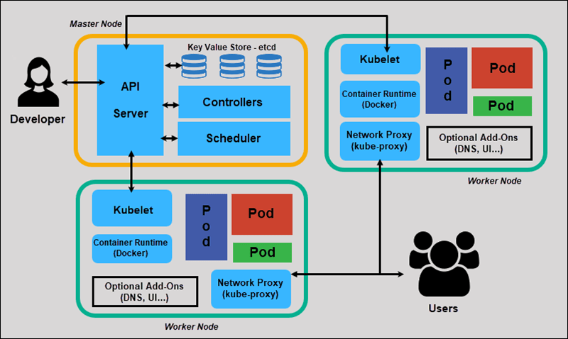
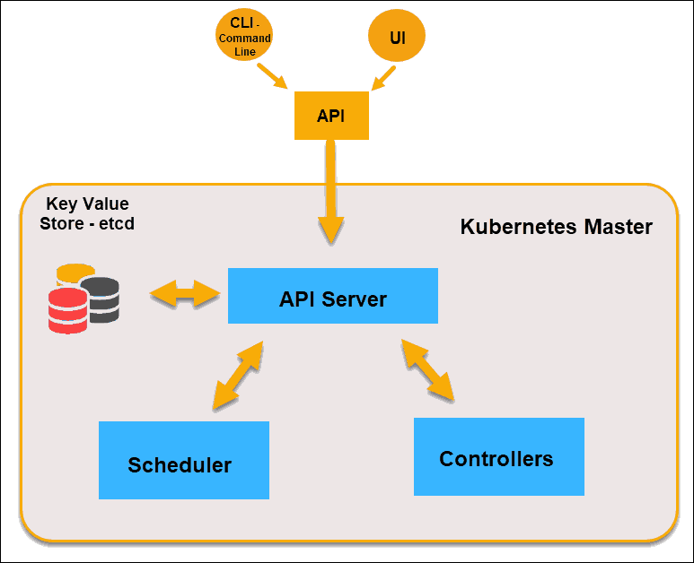
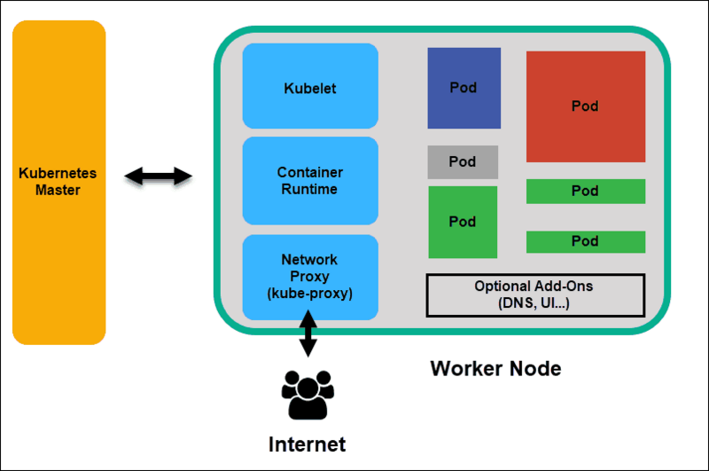
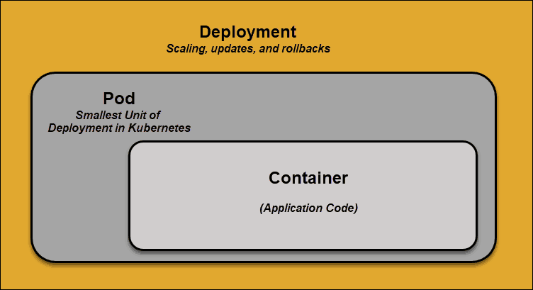

# 七张图了解k8s内部的架构

## Kubernetes架构和组成

`Kubernetes` 具有去中心化的架构，不会线性处理任务。它基于声明性模型运行并实现"所需状态"的概念。下面这些步骤说明了 `Kubernetes` 的基本过程:

* 管理员创建应用程序的所需状态并将其放入清单文件manifest.yml中。
* 使用CLI或提供的用户界面将清单文件提供给 `Kubernetes API Server`。 `Kubernetes`的默认命令行工具称为kubectl。
* `Kubernetes`将清单文件（描述了应用程序的期望状态）存储在称为键值存储（etcd）的数据库中。
* `Kubernetes`随后在集群内的所有相关应用程序上实现所需的状态。
* `Kubernetes`持续监控集群的元素，以确保应用程序的当前状态不会与所需状态有所不同。

## 主节点

`Kubernetes` 的主节点通过API从CLI（命令行界面）或UI（用户界面）接收输入。这些是你提供给 `Kubernetes` 的命令。

你可以定义想要让 `Kubernetes` 维护的Pod，副本集和Service。例如，要使用的容器镜像，要公开的端口以及要运行的Pod副本数量。还可以为该集群中运行的应用程序提供"所需状态"的参数。

### API Server

API Server是Kubernetes控制程序的前端，也是用户唯一可以直接进行交互的Kubernetes组件，内部系统组件以及外部用户组件均通过相同的API进行通信。

### 键值存储etcd

键值存储（也称为etcd）是Kubernetes用来备份所有集群数据的数据库。它存储集群的整个配置和状态。主节点查询etcd以检索节点，容器和容器的状态参数。

### Controller

控制器的作用是从API Server获得所需状态。它检查要控制的节点的当前状态，确定是否与所需状态存在任何差异，并解决它们（如果有）。

### Scheduler

调度程序会监视来自API Server的新请求，并将其分配给运行状况良好的节点。它对节点的质量进行排名，并将Pod部署到最适合的节点。如果没有合适的节点，则将Pod置于挂起状态，直到出现合适的节点。

> 注意：最好不要在主节点上运行用户应用程序。让Kubernetes主节点可以完全专注于管理集群。

## 工作节点

工作节点监听API Server发送过来的新的工作分配；他们会执行分配给他们的工作，然后将结果报告给Kubernetes主节点。

### Kubelet

kubelet在群集中的每个节点上运行。它是Kubernetes内部的主要代理。通过安装kubelet，节点的CPU，RAM和存储成为所处集群的一部分。它监视从API Server发送来的任务，执行任务，并报告给主节点。它还会监视Pod，如果Pod不能完全正常运行，则会向控制程序报告。然后，基于该信息，主服务器可以决定如何分配任务和资源以达到所需状态。

### Container Runtime

容器运行时从容器镜像库中拉取镜像，然后启动和停止容器。容器运行时由第三方软件或插件（例如Docker）担当。

### Kube-proxy

kube-proxy确保每个节点都获得其IP地址，实现本地iptables和规则以处理路由和流量负载均衡。

### Pod

在Kubernetes中，Pod是调度的最小元素。没有它，容器就不能成为集群的一部分。如果你需要扩展应用程序，则只能通过添加或删除Pod来实现。

Pod是Kubernetes中一个抽象化概念，由一个或多个容器组合在一起得共享资源。根据资源的可用性，主节点会把Pod调度到特定工作节点上，并与容器运行时协调以启动容器。

在Pod意外无法执行任务的情况下，Kubernetes不会尝试修复它们。相反，它会在其位置创建并启动一个新Pod。这个新Pod是原来的副本，除了DNS和IP地址都和以前的Pod一样。此功能对开发人员设计应用程序的方式产生了深远的影响。

由于Kubernetes架构的灵活性，不再需要将应用程序绑定到Pod的特定实例。取而代之的是，需要对应用程序进行设计，以便在集群内任何位置创建的全新Pod可以无缝取代旧Pod。Kubernetes会使用Service来协助此过程。

## Kubernetes Service

Pod不是恒定的。 Kubernetes提供的最佳功能之一是无法正常运行的Pod会自动被新的Pod取代。

但是，这些新的Pod具有一组不同的IP。这可能导致处理问题，并且由于IP不再匹配，IP流失。如果无人看管，此属性将使吊舱高度不可靠。

为了将稳定的IP地址和DNS名称引入到不稳定的Pod世界中，Kubernetes引入了Service来提供可靠的网络连接。

通过控制进出Pod的流量，Service提供了稳定的网络终结点-固定的IP，DNS和端口。有了Service，可以添加或删除任何Pod，而不必担心基本网络信息会改变。

### Service是怎么工作的

Pod通过称为标签（Label）和选择器（Selector）的键值对与Service相关联。Service会自动发现带有与选择器匹配的标签的新Pod。

此过程无缝地将新的Pod添加到Service，同时，从群集中删除已终止的Pod。

例如，如果所需状态定义了需要一个Pod的三个副本，而运行一个副本的节点发生故障，则当前状态将减少为两个Pod。Kubernetes观察到所需的状态是三个Pod。然后，它会调度一个新副本来代替发生故障的Pod，并将其分配给集群中的另一个节点。

通过添加或删除容器来更新或缩放应用程序时，同样适用。一旦我们更新了所需状态的定义，Kubernetes就会注意到差异并添加或删除Pod以匹配清单文件manifest.yml里定义的所需状态。Kubernetes控制面板记录，实现和运行后台协调循环，该循环会不断检查环境是否符合用户定义的环境要求

## 总结

