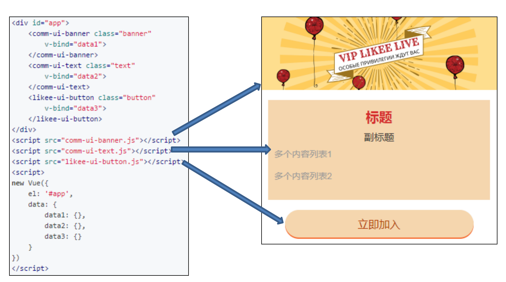
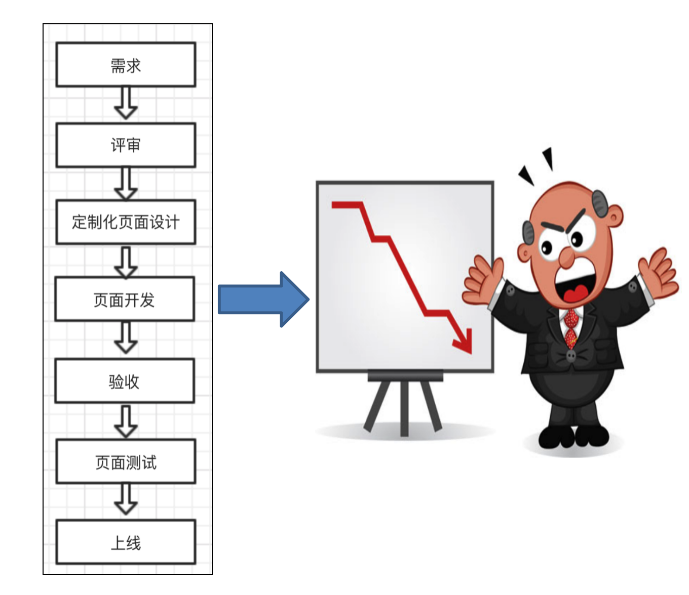
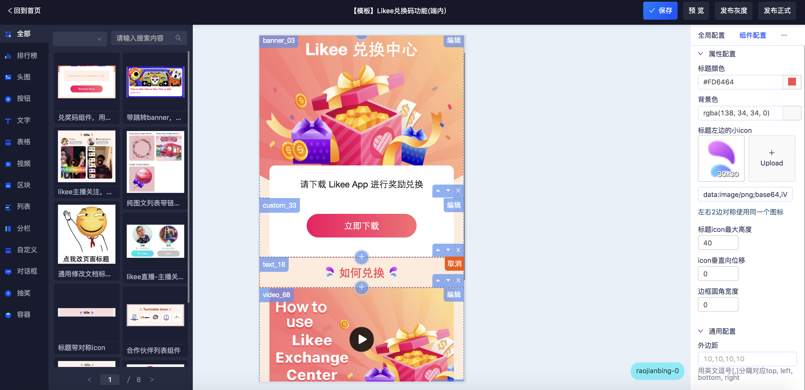
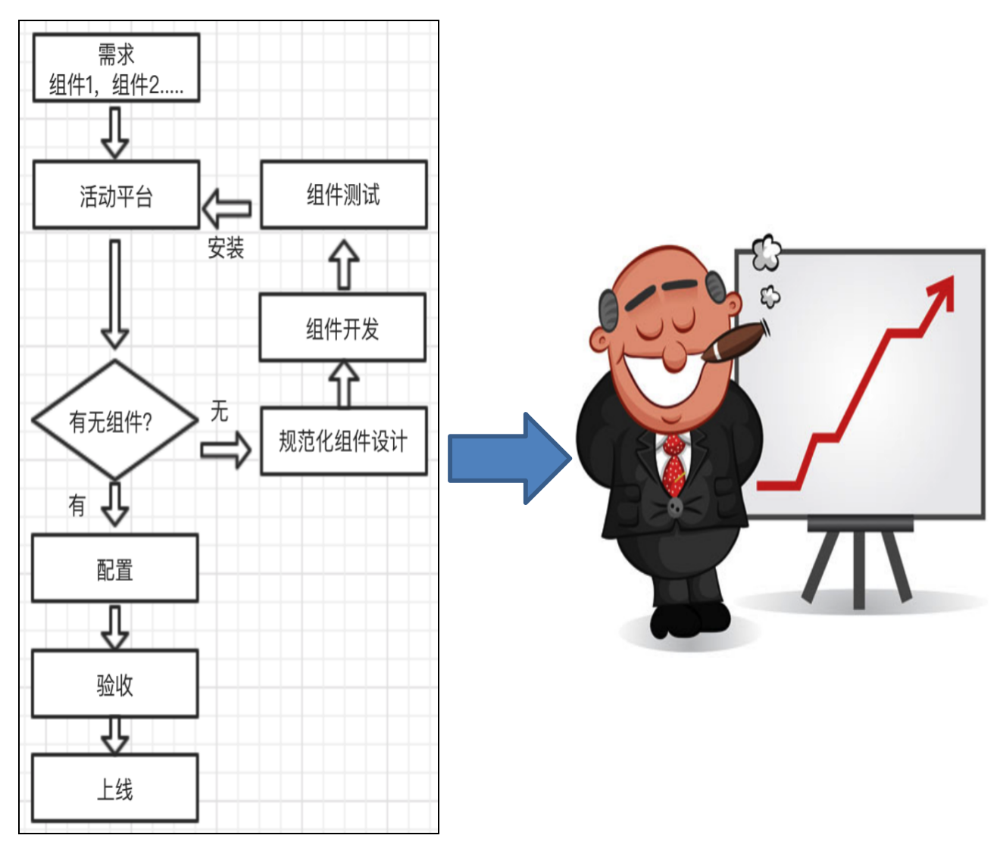
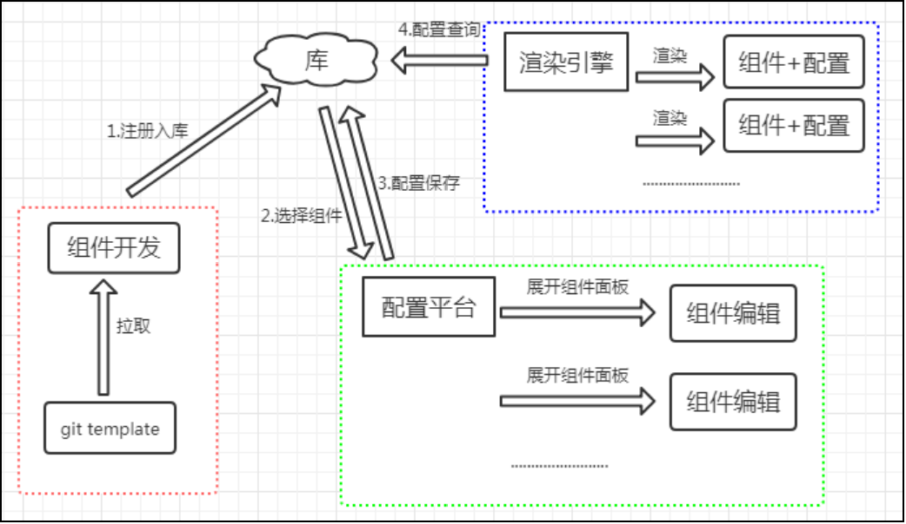
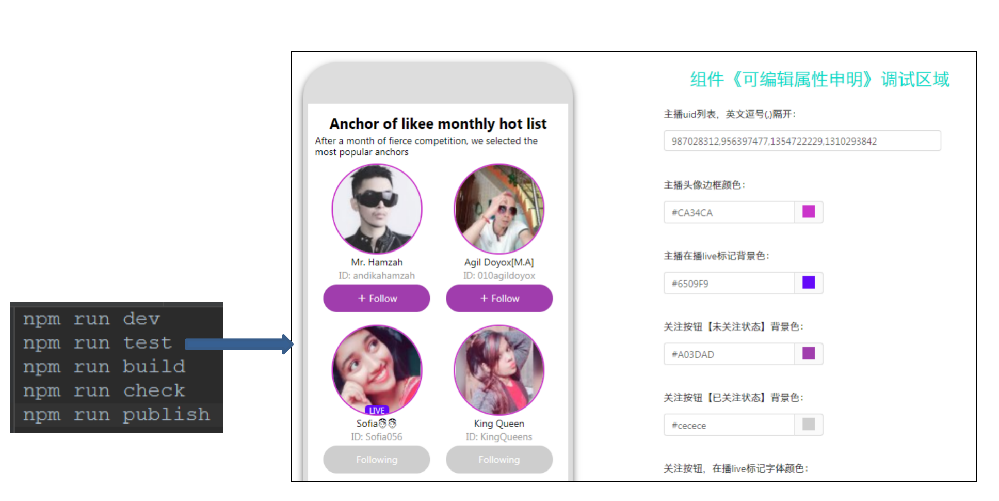
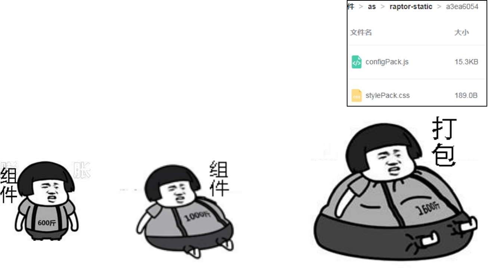
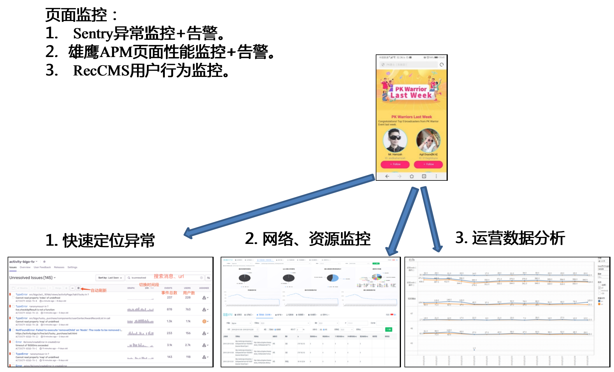

# 何为组件

### 组件

即是将页面的某一部分独立出来，将这一部分的用黑盒的形式全部封装到一个组件内，暴露出一些属性供外部组件传入值

### 白话解释

> 执行一段‘组件脚本’后，可以写“非法”HTML标签（指代组件实例），并在标签内绑定数据，该标签（组件）会根据自身逻辑，渲染出相关视图。

**如下图**

 

# 背景

### 一段不堪回首的经历😭

 

### 需求上线流程图

**特征：**
1.  参与人员多。
2.  上线周期长。

 

### 可视化平台设想

**特征：**
1.  设计、开发协作，提供通用、规范UI组件。
2.  用户创建活动，选择需要的组件，编辑组件数据。
3.  保存，预览，发布，访问。

 

**如下图👇**

 

### 上线流程图设想

**特征：**
1.  人员少：仅运营1人。
2.  上线快：小时级周期。

 

 

### 平台启动前思考🤔

`组件开发`：
平台的组件数量应该无限制，组件之间独立，组件与平台解耦，做到动态加载、编辑组件。

`配置平台`：
对外的核心交互，配置平台负责可视化创建页面，选择组件，编辑数据。

`页面渲染`：
平台的最终产物，保存活动配置后，渲染页应该仅加载本活动涉及的组件。

`总结`：
组件开发模块：负责产出页面的基本单元——组件。
配置平台模块：负责可视化创建，编辑活动页。
页面渲染模块：负责呈现活动视图。

 

# 平台实现

### 组件开发架构图

 

### 组件开发环境

**组件开发：**
1.  提供集中式开发、管理组件的项目环境。
2.  支持命令式创建、调试、编译、校验、发布组件。

 

### 再来说下组件形态

1.  一段可执行JS脚本——组件本身。
2.  一份XLSX文件——多地区语言配置。
3.  一份JSON文件——可编辑属性申明。

 

### 组件发布

>命令式发布，相关字段被完善，注册入库。

 

# 平台实现

### 页面配置一览

 

### 页面配置-编辑

 

### 页面配置-发布

**发布流程**
1.  将组件、配置打包。
2.  打包文件推至CDN。

 

### 页面渲染-解析

1.  加载CDN配置文件。
2.  遍历Render组件并传入该组件配置

 

### 页面渲染-监控

1.  异常监控+告警。
2.  页面性能监控+告警。
3.  用户行为监控。

### 总结

- `组件开发`：关键数据有JS, JSON, XLSX。
- `页面配置`：选择组件，编辑组件，保存配置。
- `页面渲染`：逐个渲染组件并传入配置，页面监控。

 

# 实现细节总结

- `组件编辑面板`: 根据组件JSON配置，展开编辑面板。
- `组件通信`: 将发射、接收的事件、方法名申明，添加事件监听并调用暴露方法。
- `组件嵌套`: 配置中父子关系链。
- `多语言`: 汇总各组件多语言文件，集中处理成包，再以Hash ID分发。
- `主题色`: 规范视觉UI的色值占位，一套主题即一套词典。